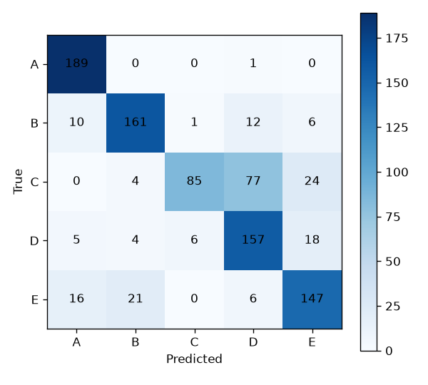
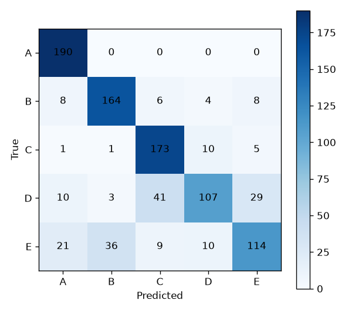
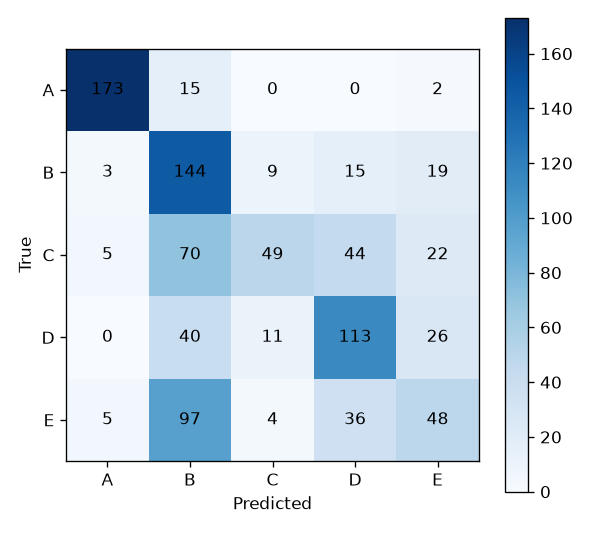

# AI 모델 재현 및 성능 비교 과제

## 1. 코드 설명
본 과제는 손바닥 표면 근전도(sEMG) 2채널 데이터를 활용해 사용자가 '문손잡이를 회전하는 동작'을 할 때 발생하는 신호를 분석하여 5명의 피험자(A~E)를 식별하는 인공지능 파이프라인을 구축하고 성능을 비교한 내용이다.

* **사용한 데이터 및 전처리 방법 :**
  * 손바닥 2채널 sEMG 센서 데이터 사용 (1000Hz 샘플링)
  * 60Hz 노치(Notch) 필터 및 20~499Hz 대역통과(Bandpass) 필터를 적용하여 노이즈 제거
  * 300ms 크기의 슬라이딩 윈도우(150ms Hop) 적용 후 Min-Max 정규화 수행
  * 연속 웨이블릿 변환(CWT)을 통해 1차원 시계열 데이터를 2차원 시간-주파수 텐서로 변환
* **사용한 AI/ML 모델 :** 
  * 2D CNN (커스텀 베이스라인)
  * ResNet18
  * DenseNet161 (사전학습 가중치 미사용)
* **학습 및 테스트 방법 :** 
  * 데이터 누수 방지를 위해 윈도우 분할 전 시행 단위로 Train 80%, Test 20% 분할. 
  * 로컬 컴퓨터 자원 한계(CPU 메모리 부족)로 인해 Batch Size 4, Epoch 3으로 단축하여 비교 실험 진행.

### 실행 방법
```bash
python main-1.py
```

### 코드 설명
각 코드 파일의 역할을 간단하게 설명한다.

| 파일 | 설명 |
| :--- | :--- |
| `main-1.py` | 신호 전처리, CWT 이미지 변환, 모델 3종 학습, 성능 평가 및 교차검증 통합 실행 |
| `data/` | 5명의 피험자(A~E)별 sEMG 원시 데이터가 저장된 폴더 |

---

## 2. 모델 성능 비교
3개 모델을 사용하여 성능을 비교다. (3 Epoch 실험 조건 기준)

| Model | Accuracy | Precision (Macro) | Recall (Macro) | F1-score (Macro) |
| :--- | :---: | :---: | :---: | :---: |
| 2D CNN | 0.5547 | 0.590 | 0.555 | 0.5383 |
| ResNet18 | 0.7874 | 0.787 | 0.787 | 0.7777 |
| DenseNet161 | 0.7779 | 0.801 | 0.778 | 0.7689 |

### 성능 분석
학습 횟수가 3회로 매우 제한된 조건에서는 망이 비교적 얕고 빠르게 수렴하는 ResNet18이 정확도 0.7874, F1-score 0.7777로 가장 우수한 성능을 나타냈다.
DenseNet161은 2,648만 개의 방대한 파라미터를 가지고 있어 학습에 가장 오랜 시간(5907.6초)이 소요되었으며, 에포크 부족으로 인해 데이터의 복잡한 패턴을 완전히 학습하지 못하고 과소적합이 발생하여 ResNet18보다 근소하게 낮은 정확도(0.7779)를 기록했다.

## 3. Confusion Matrix 분석
### Model 1 : DenseNet161

* 가장 잘 분류된 클래스 : 피험자 A (라벨 0) - 정밀도 0.859, 재현율 0.995, F1-score 0.922로 가장 안정적인 인식률을 보였디.

* 가장 많이 오분류된 클래스 : 피험자 C (라벨 2) - 재현율이 0.447로 가장 낮아 본인의 데이터를 절반 이상 놓쳤다.

* 주요 오분류 유형 : 실제 'C' 클래스 데이터를 'D' 클래스(라벨 3)로 예측하는 빈도가 가장 높았다.

* 오분류가 발생한 이유에 대한 분석 : 피험자 C와 D가 문손잡이를 잡고 돌릴 때 작용하는 손바닥 근육의 힘과 파지 습관이 매우 유사하여, CWT로 추출된 주파수 스펙트럼에서 두 사람의 신호 패턴이 겹치는 구간이 많았기 때문으로 분석된다. 학습 횟수가 부족해 클래스 간 미세한 경계를 명확히 분리하지 못했다.

### Model 2 : ResNet18


* 가장 잘 분류된 클래스 : 피험자 A (라벨 0) - 재현율 1.000, F1-score 0.905를 기록했다.

* 가장 많이 오분류된 클래스 : 피험자 D (라벨 3) - 재현율이 0.563으로 전체 클래스 중 가장 낮았다.

* 주요 오분류 유형 : 실제 'D' 클래스 데이터를 'C' 클래스(라벨 2)로 가장 많이 오분류했다.

* 오분류가 발생한 이유에 대한 분석 : DenseNet161(C를 D로 착각)과 반대로 D를 C로 착각하는 경향이 뚜렷하게 나타났다. 모델 구조와 무관하게 두 피험자의 생체 신호 자체가 물리적으로 가장 유사함을 보이며, 오분류의 근본적 원인이 데이터 자체의 형태적 유사성에 있음을 보여준다.

### Model 3 : 2D CNN


* 가장 잘 분류된 클래스 : 피험자 A (라벨 0) - 재현율 0.911, F1-score 0.920으로 다른 클래스에 비해 압도적으로 높은 인식률을 보였다.

* 가장 많이 오분류된 클래스 : 피험자 E (라벨 4) - 재현율이 0.253으로 가장 낮아 본인의 데이터를 대부분(약 75%) 놓쳤다.

* 주요 오분류 유형 : 실제 'E' 클래스 데이터를 'B' 클래스(라벨 1)로 예측하는 빈도가 가장 높았다.

* 오분류가 발생한 이유에 대한 분석 : 2D CNN은 파라미터 수가 19,717개로 매우 적고 단순한 구조를 가진 커스텀 베이스라인 모델이다. 망의 깊이가 얕아 CWT로 변환된 복잡한 주파수-시간 특징을 충분히 학습하고 추출할 능력이 부족했다. 그 결과 데이터 패턴이 명확한 특정 피험자(A)를 제외하고는 클래스 간 미세한 신호 차이를 구분하지 못해 오분류율이 높게 나타났다.

## 4. 최종 결과

* 가장 성능이 좋은 모델 : ResNet18 (단, 3 Epoch 실험 조건 한정)

* 가장 성능이 낮은 모델 : 2D CNN

* 주요 오분류 클래스 : 피험자 D (피험자 C로 빈번하게 오인됨)

* 전체적인 실험 결과 및 느낀 점:
로컬 환경의 제약으로 학습 에포크를 단축하여 전반적인 성능 수치는 하락했으나, 구조적 깊이가 있는 ResNet18과 DenseNet161 모두 77~78% 수준의 정확도를 확보했다. 특히 C와 D 간의 혼동이 두 모델에서 공통적으로 도출된 점은 CWT 변환과 누수 방지 데이터 분할을 포함한 전체 로직이 성공적이고 유효하게 작동하고 있음을 증명한다. 향후 충분한 컴퓨팅 자원을 활용해 45 Epoch 이상 학습을 진행하고, 다중 세션 데이터를 추가하여 일관성을 검증한다면 보다 정확한 식별 모델을 완성할 수 있을 것 같다.
